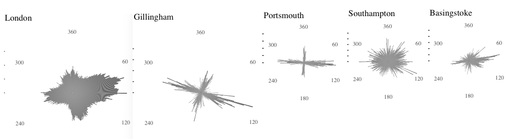
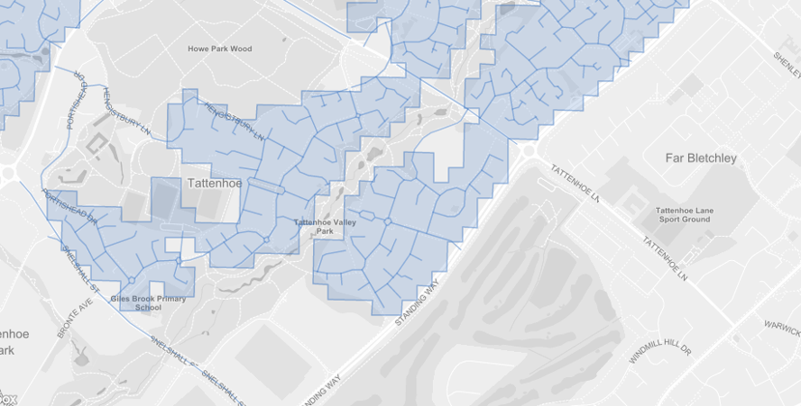
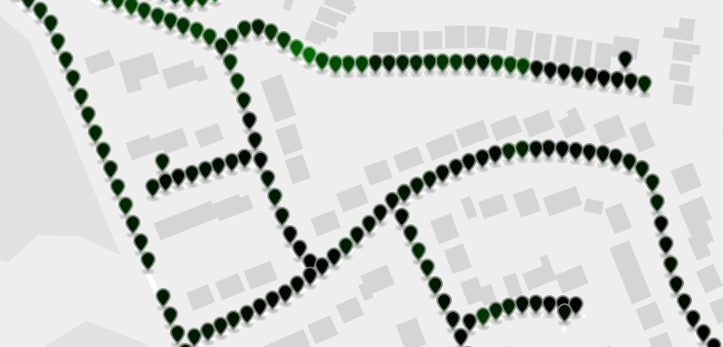

# OpenStreetMap road network parser

> Generate equidistant points along urban area road network

This repo. contains code + a set of scripts for extracting equidistant points
for cities/urban areas in a national road network. Specifically, for each road
within a city, a set of points are generated at equal distances along with the
associated heading/bearing for each point. The points/bearings are then output
to a CSV.

This is part of a larger project which uses these sample points and associated
bearings to query
[Google street view API](https://developers.google.com/maps/documentation/streetview/intro) 
for all images on the left and right hand side of a road network. The sample
points may be useful as inputs into other projects or may be used in isolation
to derive city specific geospatial features. For example, we have
[found](data/csv_output/final/interesting.R) that the distribution of sample
point bearings for most UK cities is biased toward North, East, South, West and
not uniform:



This could be related to historical relationships with neighboring towns and
is representative of the overall spatial layout of a town's road network. We
plan to explore this idea/finding at a later date. For example, it may be
interesting to compare this data with road safety: towns with a predominant
East, West road orientation *may* exhibit higher occurrence of incidents with
respect to traveling in the direction of a rising/setting sun.

## Dependencies

* [osmium](http://wiki.openstreetmap.org/wiki/Osmium)
* nodejs, npm
* [osmtogeojson](https://github.com/tyrasd/osmtogeojson)
* [geojsplit](https://www.npmjs.com/package/geojsplit)
* json\_pp

### osmium

```
mkdir osmium ;cd osmium
git clone https://github.com/mapbox/protozero
git clone https://github.com/osmcode/libosmium
git clone https://github.com/osmcode/osmium-tool
cd osmium-tool
mkdir build ;cd build
cmake ..
make
sudo make install
```

### geojsplit

```
sudo npm -g install geojsplit
sudo ln -s /usr/local/node-v6.11.1-linux-x64/lib/node_modules/geojsplit/bin/geojsplit /usr/local/bin/geojsplit
```

## Building

```
make
```

## Running

The whole process can be executed by invoking the `run.sh` script.

```
./run.sh
```

This will perform the following steps:

1) **Get ONS major towns and cities polygon data**. 
[data/area\_geojson](data/area_geojson/split.sh) will download the 112 major 
towns and cities geojson data from 
[ONS Geography portal](http://geoportal.statistics.gov.uk/datasets/major-towns-and-cities-december-2015-boundaries),
then extract each city into individual geojson files in `data/area_geojson/split/`.

2) **Extract the road network for each city**. 
[extract\_roads.sh](extract_roads.sh) will download the latest open street map
data for Great Britain, extract the road network using 
[osmium](http://wiki.openstreetmap.org/wiki/Osmium), and then for each city,
extract the road network bounded by the city polygon obtained in step (1) and 
convert to geojson:



3) **Generate sample points for each city**. 
For each individual city road network in `data/city_roads_geojson/`
extracted in step (2), [sample\_points.sh](sample_points.sh) will generate a set
of 10 metre equidistant points along each road, storing the result in 
`data/csv_output`. For convenience, the resulting sample points are also 
aggregated into a single file `data/csv_output/final/england_and_wales.csv`.



## Output

The result is a csv file for each city stored in 
`data/csv_output/CITY_NAME.csv`. For example:

|osm_way_id  |road_name        |road_type |sidewalk |abutters | lanes|lighting |surface | speed_limit| sequence|area       | latitude| longitude| bearing|
|:-----------|:----------------|:---------|:--------|:--------|-----:|:--------|:-------|-----------:|--------:|:----------|--------:|---------:|-------:|
|way/4355028 |Barlow Moor Road |secondary |         |retail   |     2|yes      |asphalt |          30|       40|Manchester | 53.43965| -2.275101|  170.17|
|way/4355028 |Barlow Moor Road |secondary |         |retail   |     2|yes      |asphalt |          30|       41|Manchester | 53.43957| -2.275076|  170.17|
|way/4355028 |Barlow Moor Road |secondary |         |retail   |     2|yes      |asphalt |          30|       42|Manchester | 53.43948| -2.275051|  170.17|
|way/4355028 |Barlow Moor Road |secondary |         |retail   |     2|yes      |asphalt |          30|       43|Manchester | 53.43939| -2.275026|  170.17|
|way/4355028 |Barlow Moor Road |secondary |         |retail   |     2|yes      |asphalt |          30|       44|Manchester | 53.43931| -2.275001|  170.17|
|way/4355028 |Barlow Moor Road |secondary |         |retail   |     2|yes      |asphalt |          30|       45|Manchester | 53.43922| -2.274976|  170.17|
|way/4355028 |Barlow Moor Road |secondary |         |retail   |     2|yes      |asphalt |          30|       46|Manchester | 53.43913| -2.274951|  170.17|
|way/4355028 |Barlow Moor Road |secondary |         |retail   |     2|yes      |asphalt |          30|       47|Manchester | 53.43905| -2.274925|  170.17|
|way/4355028 |Barlow Moor Road |secondary |         |retail   |     2|yes      |asphalt |          30|       48|Manchester | 53.43896| -2.274897|  158.42|
|way/4355028 |Barlow Moor Road |secondary |         |retail   |     2|yes      |asphalt |          30|       49|Manchester | 53.43889| -2.274844|  151.79|

Where:

|Column      |Description                                          |
|:-----------|:----------------------------------------------------|
|osm_way_id  |Road network "Edge" id                               |
|road_name   |Road name                                            |
|road_type   |Road network classification (see below)              |
|sidewalk    |Path on left,right?                                  |
|abutters    |Road features                                        |
|lanes       |Number of lanes                                      |
|lighting    |Road has lighting?                                   |
|surface     |Surface type                                         |
|speed_limit |Speed limit                                          |
|sequence    |Sample point order                                   |
|area        |City                                                 |
|latitude    |Latitude                                             |
|longitude   |Longitude                                            |
|bearing     |Heading (angle of line from previous to next point.) |
 

## Road network classifications

|OSM label    |UK Meaning                                      |
|:------------|:-----------------------------------------------|
|motorway     |M- road	                                       |
|trunk        |A- road                                         |
|primary      |A- non-primary                                  |
|secondary    |B- road                                         |
|tertiary     |Significant minor road (with road markings etc) |
|unclassified |Less significant road                           |
|residential  |Residential road                                |

## Licence

Open Government license v3 [OGL v3](http://www.nationalarchives.gov.uk/doc/open-government-licence/version/3/).
